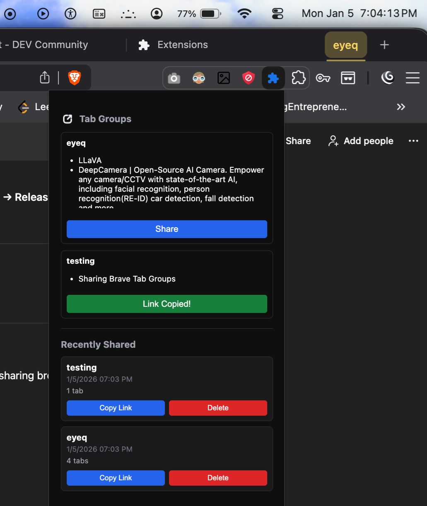
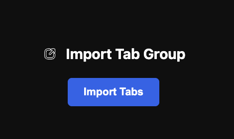

# TabShare – Share Browser Tab Groups via Link

TabShare is a lightweight Chrome / Brave extension that lets you share a browser **tab group** as a link and restore it later.

### Extension

### Extension image page


This project was built to understand:
- Chrome extension APIs
- Tab Groups handling
- Browser security boundaries
- Sharing state without a backend

It works locally using **Load unpacked** (no Chrome/Brave Web Store required).

---

## ✨ Features

### Core
- Detects all tab groups in the current window
- Lists tabs inside each group
- One-click share generates and copies a link
- Restores the full tab group from the link
- Works on Chrome and Brave (Chromium-based browsers)

### Share History
- Stores the **last 10 shared tab groups**
- Shows **timestamp** for each shared group
- Quick **copy link** button for history items
- Delete individual history entries
- Prevents duplicate entries in history

---

### 1. Clone the repository
```bash
git clone https://github.com/SidhuAchary02/tabshare-extension.git
cd tabshare-extension

```

## Enable Developer option in chrome extendion store

#### then load packed on store, u are ready.

it will work to share others, once publish on extension store.